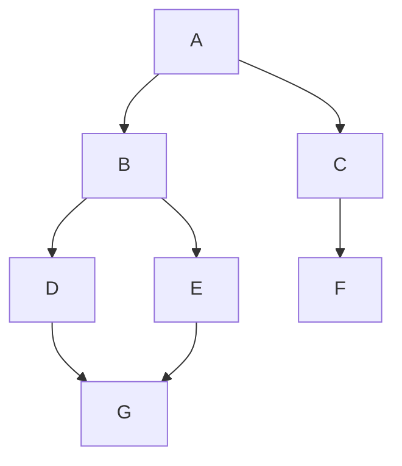

# Amazon Connect Path Finder

This package is used to find all of the paths in a contact flow.

The paths are separated by the contact channel type. (Voice, Chat, Task, Email)

Version 1.0.0 uses the raw JSON of the contact flow to find the paths.

Next version will use an IR (Intermediate Representation) of the contact flow to find the paths.

> [!IMPORTANT]
> At the moment, only published contact flows are supported.

## How does it work?

The goal is to create a list of lists that represent all of the paths a contact can take in the contact flow.

Here is an example of a simple flow:



The output should be:

```typescript
const allPaths = [
  [A, B, D, G],
  [A, B, E, G],
  [A, C, F],
];
```

Since certain blocks and contact flow types only support specific contact channels, the paths will be separated by the contact type.

For example:

```typescript
const allPaths = {
  voice: [
    [A, B, D, G],
    [A, B, E, G],
    [A, C, F],
  ],
  chat: [
    [A, B, D, G],
    [A, B, E, G],
    [A, C, F],
  ],
  task: [
    [A, B, D, G],
    [A, B, E, G],
    [A, C, F],
  ],
  email: [
    [A, B, D, G],
    [A, B, E, G],
    [A, C, F],
  ],
};
```

### Pseudocode for creating paths

First, there is a stack representing the state of each path.

```typescript
type Node = {
  id: string;
  type: string;
  name: string;
  path: Node[];
};

const pathStack: Node[] = [];
```

The initial block/node is pushed onto the stack as the root node.

```typescript
pathStack.push(initialNode);
```

Then we loop until the stack is empty.

For each node/block, we do the following:

1. Pop the node off the stack
2. Check if the node has any children nodes/blocks by checking the `Transitions` property in the contact flow block.
3. If there are no children nodes/blocks, we have reached the end of the path and we can add the path to the list of paths.
4. If there are children nodes/blocks, we need to do the following:
   1. Create new nodes for each child node/block
   2. The path for each child node/block will be the concatenation of the parent node's path and the parent node itself
   3. Push each child node onto the stack

```typescript
// Example of checking if the node has children nodes/blocks

if (!node.Transitions) {
  // No children nodes/blocks, we have reached the end of the path
  allPaths.push(node.path);

  return;
}

// There are children nodes/blocks, we need to create new nodes for each child node/block
const parentNode = node;
for (const transition of node.Transitions) {
  const childNode = {
    id: transition.NextAction || transition.Errors,
    type: transition.Type,
    name: transition.Name,
    path: [...parentNode.path, parentNode],
  };

  pathStack.push(childNode);
}
```

There are exceptions to the above logic:

- If the node is a special type called a `Loop` node, instead of creating a new node for each child node/block, we want to only create nodes that's conneted to the `ContinueLooping` path until the maximum number of loops is reached.
  - When the maximum number of loops is reached, we can add the node that's connected to the `DoneLooping` path to the stack.

```typescript
// Example of creating a new node for a Loop node

interface LoopNode extends Node {
  maxLoopCount: number;
  loopCount: number;
}

// Assuming the node has children nodes/blocks
const parentNode = node;

// First, we need to update the loop count
node.loopCount++;

// Compare the loop count to the max loop count
if (node.loopCount > node.maxLoopCount) {
  // We have reached the max loop count, we can add the node that's connected to the `DoneLooping` path to the stack
  const parentNode = node;

  const nodeAfterMaxLoopCountInfo = node.Transitions.find(
    (transition) => transition.NextAction === "DoneLooping"
  );

  const nodeAfterMaxLoopCount = {
    id: nodeAfterMaxLoopCountInfo.NextAction,
    type: nodeAfterMaxLoopCountInfo.Type,
    name: nodeAfterMaxLoopCountInfo.Name,
    path: [...parentNode.path, parentNode],
  };

  pathStack.push(nodeAfterMaxLoopCount);

  return;
}

// The max loop count has not been reached, we can add the node that's connected to the `ContinueLooping` path to the stack
const parentNode = node;

const nodeAfterLoopInfo = node.Transitions.find(
  (transition) => transition.NextAction === "ContinueLooping"
);

const nodeAfterLoop = {
  id: nodeAfterLoopInfo.NextAction,
  type: nodeAfterLoopInfo.Type,
  name: nodeAfterLoopInfo.Name,
  path: [...parentNode.path, parentNode],
};

pathStack.push(nodeAfterLoop);
```

## Logic/Rules for the contact flow paths finder

First, it will read the contact flow type.

Next, it will loop through the action blocks in the contact flow.

Then based on 4 data types, the algorithm will find the paths:

- `Contact Flow Type`
- `Contact Channel Type`
- `Action Block Type`
- `Contact Attribute`

### Flow Type Validation and Rules

> [!IMPORTANT]
> The outbound campaign flow is not supported yet.

First, we will validate that the contact flow type is valid.

Then, we will validate that both the action block and the contact channel type are valid for the contact flow type.

### Action Block Validation and Rules

First, we will validate that the action block is valid.

Then based on the action block type, the algorithm will create paths depending on the behaviours of the action block.

For example, if the block type is `Loop`, the algorithm will be different than if the block type is `PlayPrompt`.

### Contact Channel Type Validation and Rules

First, we will validate that the contact channel type is valid.

Then, we will validate that the contact channel type is valid for the contact flow type.

### Contact Attribute Validation and Rules

Contact attributes have 3 main purposes in a contact flow:

- Routing
- Playing prompts
- Input (To lambda, etc)

Also, there are many types of Contact Attributes:

- `System`
- `Segments`
- `View`
- `Capabalities`
- `Agent`
- `Queue`
- `Telephony Call Metadata`
- `Chat initial message`
- `Media`
- `Lex`
- `Cases`
- `Lambda`
- `User Defined`
- `Flow`
- `Apple Messge for Business`
- `Customer Profile`
- `Outbound Campaign`

Blocks, Contact Flow type, Contact Channel type, Instance Settings all affect contact attributes.

We will validate that the contact attribute is using the valid namespace/type.

> [!WARNING]
> It will not validate if a contact attribute value can be set for a given namespace.

### Relationship between data types

#### Flow Type relationship with action block

An action block can be used in one or more contact flows types.

```typescript
const endFlowResumeBlock = {
  type: "End flow / Resume",
  contactFlowTypes: ["Customer Queue Flow", "Inbound Flow"],
};
```

If the block cannot be used for the contact flow type, we will throw an error.

If the block can be used for the contact flow type, the algorithm will check how the block's behaviour is affected by the contact flow type.

For example, `End flow / Resume` block changes behaviour based on the contact flow type:

- For Customer Queue Flow, the block will restart the flow.
- For Inbound Flow, the block will end the flow.

Another example is the `Play Prompt` block:

- For Inbound Flow, the block supports all configuration options.
- But for Customer Queue Flow, it cannot play a prompt from S3.

#### Flow Type relationship with contact channel type

Depending on the contact flow type, only certain contact channel types are valid.

For example, a Customer hold flow can only use Voice.

```typescript
const customerHoldFlow = {
  type: "Customer Hold Flow",
  contactChannelTypes: ["Voice"],
};
```

We will only create paths for the contact channel types that are valid for the contact flow type.

#### Flow Type relationship with contact attribute

A contact attribute can be used in one or more contact flow types.

```typescript
const contactAttribute = {
  type: "Contact Attribute",
  contactFlowTypes: ["Customer Hold Flow", "Inbound Flow"],
};
```

If the contact attribute is not valid for the contact flow type, we will throw an error.

If the contact attribute is valid for the contact flow type, the algorithm will check how the contact attribute can be used for the contact flow type.

#### Action Block relationship with contact channel type

An action block can be used in one or more contact channel types.

```typescript
const playPromptBlock = {
  type: "PlayPrompt",
  contactChannelTypes: ["Voice", "Chat"],
};

const voiceIdBlock = {
  type: "VoiceId",
  contactChannelTypes: ["Voice"],
};
```

Also the behaviour of the block can change based on the contact channel type.

Lastly, a block's configuration affects which contact channel type is supported.

If a contact channel type is not supported by the action block, we will always go to the error path.

#### Action Block relationship with contact attribute

A contact attribute can be used in one or more action blocks.

```typescript
const contactAttribute = {
  type: "Contact Attribute",
  actionBlocks: ["PlayPrompt", "Invoke Lambda"],
};
```

If the contact attribute is not valid for the action block, we will either throw an error or create paths assuming the value is an empty string. This will depend both on the contact attribute type and the action block type.

#### Contact Channel Type relationship with contact attribute

A contact channel type can be used in one or more contact attributes.

```typescript
const contactAttribute = {
  type: "Contact Attribute",
  contactChannelTypes: ["Voice", "Chat"],
};
```

If the contact attribute is not valid for the contact channel type, we will either throw an error or create paths assuming the value is an empty string. This will depend both on the contact attribute type and the contact channel type.

## How does it handle dependencies?

At the moment, there are 2 main dependencies:

- `Contact Attribute` This is used for routing, playing prompts, and as input for other blocks.
- User/Customer dependant data
  - Customer input
  - Store customer input
  - Voice Audio
  - Chat transcript
  - DTMF
  - etc

### Handling Contact Attributes Dependency

In a contact flow, a block is dependent on a contact attribute if the block uses one or more of it in it's own configuration.

```typescript
const playPromptBlock = {
  type: "PlayPrompt",
  value: "Hello! $.External.FirstName $.External.LastName!",
};
```

The above example relies on `FirstName` and `LastName` attribute values that's set by a `Invoke Lambda` block.

We know this because `$.` is a reserved keyword in Amazon Connect to reference a contact attribute. And the `External` namespace is only available for Lambda responses.

> [!IMPORTANT]
> A Contact Attribute can be set by a Block, Internal System (Amazon Connect), or External System (App, API, etc).
> If there's no reference of a contact attribute being set, the contact could already have the attribute from a previous conversation.
> For example, even if the contact flow does not set a particular contact attribute, the attribute could exist because it's a transfer from an agent or set by a previous conversation.
> This means that the algorithm needs to either ask the Client (the user of this software) to provide the contact attribute value (if it can't find a reference to the contact attribute), or create paths assuming all routes are possible.

Key things to remember about contact attributes:

- A contact attribute that a block depends on, comes from either the previous flow(s) or from the previous conversation.
- A Contact Attribute can be overwritten by a block or an external system.

#### Rules for handling contact attributes

1. Keep track of the latest value of a contact attribute up to that point.
2. If a block sets a contact attribute, update the key-value pair.
3. If a block implicitly sets a contact attribute, update the key-value pair.
4. If a contact type changes the value of a contact attribute, update the key-value pair.
5. If a contact event sets a contact attribute, update the key-value pair.
6. If a Lambda block is used, ask the Client to provide the input and output of the Lambda function for the external namespace.
7. Replace the entire external namespace if another Lambda block is used.
8. Delete the Flow namespace if the contact flow ends.

#### Pseudocode for handling contact attributes

To keep track of the latest set of contact attributes, we will store the set in a stack.

```typescript
const contactAttributeStack: ContactAttribute[] = [];

const contactAttribute = {
  [namespace]: {
    [key]: string;
  };
};
```

> [!IMPORTANT]
> A stack allows the end users to see the state of the contact attributes at any point in the path.

The stack will be updated each time we insert a new action block into the path stack.

```typescript
pathStack.push(newNode);
contactAttributeStack.push(contactAttribute); // Also insert the contact attributes
```

This makes sure that the action block uses the latest set of contact attributes.

```typescript
const actionBlock = pathStack.pop();
const contactAttributes = contactAttributeStack.pop();

if (
  actionBlock.type === "PlayPrompt" &&
  isDependentOnContactAttribute(actionBlock)
) {
  actionBlock.value = actionBlock.value.replace(
    `$.${contactAttributes.namespace}`,
    contactAttributes.value
  );
}
```

If the block updates a contact attribute, we will update the key-value pair in the stack.

```typescript
const contactAttributes = contactAttributeStack.pop();

contactAttributes[namespace][key] = newValue;

pathStack.push(newNode);
contactAttributeStack.push(contactAttributes);
```

If the block depends on a contact attribute but either the stack is empty or the contact attribute is not set, we will ask the Client to provide the value.

```typescript
const contactAttributes = contactAttributeStack.pop();

if (!contactAttributes) {
  // Ask the Client to provide the value
}

if (!contactAttributes[key]) {
  // Ask the Client to provide the value
}
```

### Handling User/Customer dependant data

Certain blocks wait for user/customer input.

For example:

- `Get Customer Input`
- `Get Store Customer Input`

At the current moment, the algorithm will simply tag the block as a user/customer dependant data block with a few additional properties:

- `Channel Type` this refers to the contact channel type that should be used.
- `User Action Type` this refers to the action that the user or a testing software needs to take.
  - `DTMF` -> Press a specific DTMF key
  - `Speak` -> Type out what the user should say
  - `Phone Number` -> The user/client should enter a specific phone number
- `User Action Value` this is the value that the user or a testing software should provide. Depends on the `User Action Type`.

> [!NOTE]
> The `User Action Type` will be based on the Action Block configuration.

> [!IMPORTANT]
> The algorithm will create all possible paths.
> It is up to the end user/client to provide valid values that will lead the contact to the route the algorithm has created.
> For example, if one of the paths is pressing 1 to speak to an agent, the end user/client must provide the value 1 in the `User Action Value` field.

## How to run the package

```bash
docker compose -f docker-compose-dev.yml up -d
```

## Supported Contact Flow Types/Contact Channel Types for Action Blocks

This section is a list of all of the blocks and it's supported contact flow types and contact channel types.

A contact flow type or a contact channel type might only be partially supported by a block.

Here is a legend for supported values:

| Supported Value | Description                                                                                                                                       |
| --------------- | ------------------------------------------------------------------------------------------------------------------------------------------------- |
| Yes             | The block fully supports the contact flow type or contact channel type.                                                                           |
| No              | The block does not support the contact flow type or contact channel type.                                                                         |
| Partial         | The block does support the contact flow type or contact channel type, but with some limitations. Usually based on the configuration of the block. |
| No\*            | The block does not support the contact flow type or contact channel type but it goes down the success path.                                       |

### PlayPrompt Block

| Contact Flow Type     | Supported |
| --------------------- | --------- |
| Inbound Flow          | Yes       |
| Customer Queue Flow   | Partial   |
| Customer Hold Flow    | Partial   |
| Agent Whisper Flow    | Partial   |
| Outbound Whisper Flow | Partial   |
| Transfer to Agent     | Yes       |
| Transfer to Queue     | Yes       |

`Customer Queue Flow`, `Customer Hold Flow`, `Agent Whisper Flow`, `Outbound Whisper Flow` cannot play a prompt from S3.

| Contact Channel Type | Supported |
| -------------------- | --------- |
| Voice                | Yes       |
| Chat                 | Partial   |
| Task                 | Partial   |
| Email                | No\*      |

`Chat` and `Task` will go down the error path if either S3 audio or a prompt from the library is used.

`Email` is not supported. But it always goes down the success path.

### Get Customer Input Block
