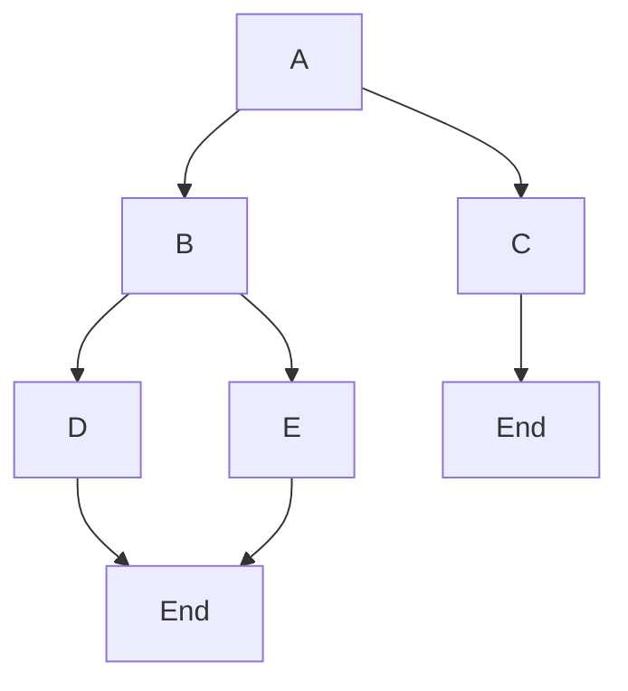

# Amazon Connect Flow Parser

This package is used to parse an Amazon Connect contact flow and use it for the following purposes:

- Create all of the paths a contact can take in the contact flow
  - Dependency Graph to show which blocks/nodes are required for routing a contact
  - Can be used for testing the contact flow (Call, Chat, Task)
- An Intermediate representation of the contact flow
  - Can be used for comparing two contact flows
  - Can be used for generating test cases for the contact flow
  - Can be used for testing the contact flow (Call, Chat, Task)
  - Can be used for generating a flow chart of the contact flow

## How does it work?

The goal is to create a list of lists that represent all of the paths a contact can take in the contact flow.

Here is an example of a simple flow:



The output should be:

```typescript
const allPaths = [
  [A, B, D, G],
  [A, B, E, G],
  [A, C, F],
];
```

### Pseudocode for creating paths

First, there is a stack representing the state of each path.

```typescript
type Node = {
  id: string;
  type: string;
  name: string;
  path: Node[];
};

const pathStack: Node[] = [];
```

The initial block/node is pushed onto the stack as the root node.

```typescript
pathStack.push(initialNode);
```

Then we loop until the stack is empty.

For each node/block, we do the following:

1. Pop the node off the stack
2. Check if the node has any children nodes/blocks by checking the `Transitions` property in the contact flow block.
3. If there are no children nodes/blocks, we have reached the end of the path and we can add the path to the list of paths.
4. If there are children nodes/blocks, we need to do the following:
   1. Create new nodes for each child node/block
   2. The path for each child node/block will be the concatenation of the parent node's path and the parent node itself
   3. Push each child node onto the stack

```typescript
// Example of checking if the node has children nodes/blocks

if (!node.Transitions) {
  // No children nodes/blocks, we have reached the end of the path
  allPaths.push(node.path);

  return;
}

// There are children nodes/blocks, we need to create new nodes for each child node/block
const parentNode = node;
for (const transition of node.Transitions) {
  const childNode = {
    id: transition.NextAction || transition.Errors,
    type: transition.Type,
    name: transition.Name,
    path: [...parentNode.path, parentNode],
  };

  pathStack.push(childNode);
}
```

There are exceptions to the above logic:

- If the node is a special type called a `Loop` node, instead of creating a new node for each child node/block, we want to only create nodes that's conneted to the `ContinueLooping` path until the maximum number of loops is reached.
  - When the maximum number of loops is reached, we can add the node that's connected to the `DoneLooping` path to the stack.

```typescript
// Example of creating a new node for a Loop node

interface LoopNode extends Node {
  maxLoopCount: number;
  loopCount: number;
}

// Assuming the node has children nodes/blocks
const parentNode = node;

// First, we need to update the loop count
node.loopCount++;

// Compare the loop count to the max loop count
if (node.loopCount > node.maxLoopCount) {
  // We have reached the max loop count, we can add the node that's connected to the `DoneLooping` path to the stack
  const parentNode = node;

  const nodeAfterMaxLoopCountInfo = node.Transitions.find(
    (transition) => transition.NextAction === "DoneLooping"
  );

  const nodeAfterMaxLoopCount = {
    id: nodeAfterMaxLoopCountInfo.NextAction,
    type: nodeAfterMaxLoopCountInfo.Type,
    name: nodeAfterMaxLoopCountInfo.Name,
    path: [...parentNode.path, parentNode],
  };

  pathStack.push(nodeAfterMaxLoopCount);

  return;
}

// The max loop count has not been reached, we can add the node that's connected to the `ContinueLooping` path to the stack
const parentNode = node;

const nodeAfterLoopInfo = node.Transitions.find(
  (transition) => transition.NextAction === "ContinueLooping"
);

const nodeAfterLoop = {
  id: nodeAfterLoopInfo.NextAction,
  type: nodeAfterLoopInfo.Type,
  name: nodeAfterLoopInfo.Name,
  path: [...parentNode.path, parentNode],
};

pathStack.push(nodeAfterLoop);
```
